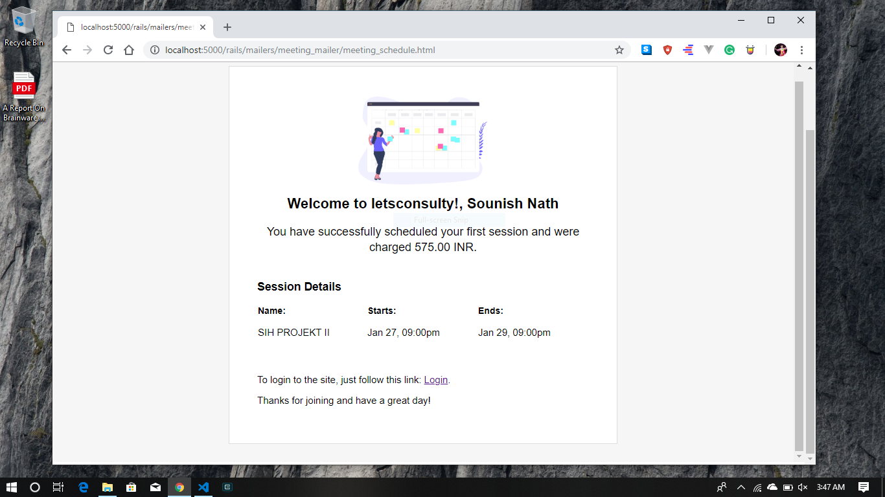

# README

## Consulty

It's a sweet and simple UI designed and organized webapp for your company day-to-day usuage.
It's lovely and the beauti of rails to manipulate every conventional connectiona=s,
and the relational database, to make a data-driven web application

## design when to recieve mail

## Why to choose Rails
   
 Ruby on Rails is a full feature framework capable of just about anything you need out of a web application. From it’s MVC pattern to is built in CLI, creating and scaling a web app with Rails can save you months of time compared to other frameworks where you need to roll your own solutions to rather common problems.
